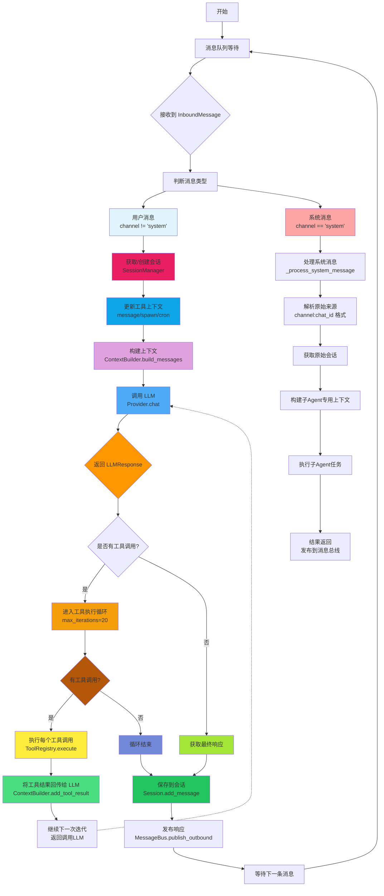
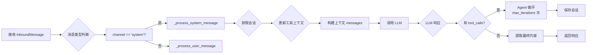
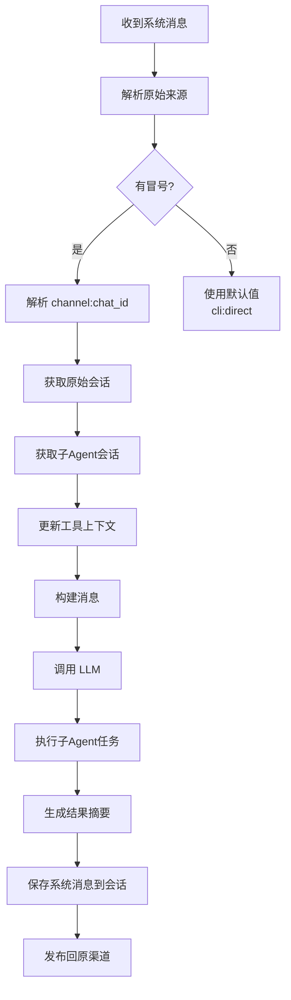
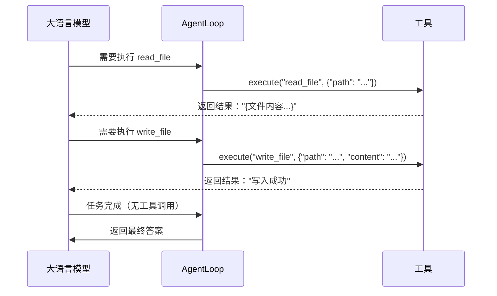
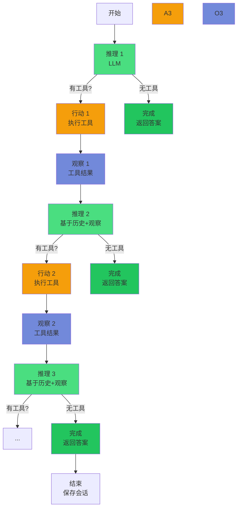

# Nanobot Agent Loop 深度分析

**分析日期**: 2026-02-05
**文件**: `nanobot/agent/loop.py`
**代码行数**: 366 行
**核心模式**: ReAct (Reason + Act)

---

## 📊 一、整体流程图

### 主处理流程 (用户消息)



---

## 📖 二、ReAct 模式详解

### 2.1 什么是 ReAct 模式

**ReAct = Reasoning + Acting**

ReAct 是一种让大语言模型能够**推理（Reason）和行动（Act）**的架构模式。其核心思想是：

1. **Reason（推理）**：模型分析问题，制定行动计划
2. **Act（行动）**：模型执行具体工具/函数
3. **Observation（观察）**：获取工具执行结果
4. **Thought（思考）**：基于观察结果更新推理

这种循环持续进行，直到任务完成或达到最大迭代次数。

### 2.2 Nanobot 中的 ReAct 实现

```python
# === 第1步：接收消息 ===
msg = await asyncio.wait_for(
    self.bus.consume_inbound(),  # 从消息队列获取
    timeout=1.0
)

# === 第2步：初始化环境 ===
# 获取或创建会话
session = self.sessions.get_or_create(msg.session_key)

# 更新工具上下文（MessageTool需要知道往哪里发送）
message_tool = self.tools.get("message")
if isinstance(message_tool, MessageTool):
    message_tool.set_context(msg.channel, msg.chat_id)

spawn_tool = self.tools.get("spawn")
if isinstance(spawn_tool, SpawnTool):
    spawn_tool.set_context(msg.channel, msg.chat_id)

cron_tool = self.tools.get("cron")
if isinstance(cron_tool, CronTool):
    cron_tool.set_context(msg.channel, msg.chat_id)

# === 第3步：构建上下文 ===
# 由 ContextBuilder 组装完整的提示词
messages = self.context.build_messages(
    history=session.get_history(),      # 历史对话（最近50条）
    current_message=msg.content,              # 当前用户输入
    media=msg.media,                         # 附件（图片等）
    channel=msg.channel,                      # 渠道标识
    chat_id=msg.chat_id                     # 会话标识
)
```

**ContextBuilder 组成的系统提示词包含**：
```markdown
# 1. 核心身份
# nanobot 🐈
# 工作空间: /path/to/workspace
# 当前时间: 2026-02-05 23:39

# 2. Bootstrap 文件（AGENTS.md, SOUL.md, USER.md, TOOLS.md, IDENTITY.md）

# 3. 记忆上下文
## Long-term Memory
[记忆内容...]

## Today's Notes
[今日笔记...]

# 4. 技能上下文
# Always 加载的技能（完整内容）
### Active Skills
[技能1内容]
[技能2内容]

# 5. 其他技能（仅摘要）
## Skills
<skill available="true">name</skill>
  <description>描述</description>
  <location>/path/to/skill</location>
</skill>
```

```python
# === 第4步：Agent 循环（核心 ReAct 迭代） ===
iteration = 0
final_content = None

while iteration < self.max_iterations:  # 最多 20 次迭代
    iteration += 1

    # === 第4a步：推理（Reasoning）- 调用 LLM ===
    response = await self.provider.chat(
        messages=messages,              # 完整消息历史
        tools=self.tools.get_definitions(),  # 工具定义列表
        model=self.model,                  # 使用的模型
    )

    # === 第4b步：分析 LLM 响应 ===
    if response.has_tool_calls:
        # LLM 想要执行工具
        # 响应格式：
        # {
        #   "content": "我需要读取文件...",
        #   "tool_calls": [
        #     {"id": "call_123", "type": "function", "function": {"name": "read_file", "arguments": {"path": "..."}}
        #   ]
        # }

        # 将工具调用转换为 OpenAI Function Calling 格式
        tool_call_dicts = [
            {
                "id": tc.id,                    # 工具调用 ID
                "type": "function",              # 固定为 "function"
                "function": {
                    "name": tc.name,         # 工具名称
                    "arguments": json.dumps(tc.arguments)  # 参数必须是 JSON 字符串
                }
            }
            for tc in response.tool_calls
        ]

        # 添加助手消息到历史
        messages = self.context.add_assistant_message(
            messages,
            response.content,      # LLM 的思考内容
            tool_call_dicts       # 工具调用列表
        )

    # === 第4c步：行动（Acting）- 执行工具 ===
    for tool_call in response.tool_calls:
        args_str = json.dumps(tool_call.arguments)
        logger.debug(f"Executing tool: {tool_call.name} with arguments: {args_str}")

        # 通过工具注册表执行
        result = await self.tools.execute(
            tool_call.name,           # 工具名称
            tool_call.arguments      # 参数字典
        )

        # 将工具执行结果回传给 LLM
        messages = self.context.add_tool_result(
            messages,
            tool_call.id,     # 工具调用 ID
            tool_call.name,   # 工具名称
            result               # 执行结果（字符串）
        )

    # === 第4d步：判断是否完成 ===
    else:
        # 没有 tool_calls，说明 LLM 已经完成
        final_content = response.content
        break  # 退出循环
```

### 2.3 代码详细讲解

#### __init__ 方法（第 37-72 行）

```python
def __init__(
    self,
    bus: MessageBus,              # 消息总线（异步队列）
    provider: LLMProvider,          # LLM 提供者接口
    workspace: Path,                # 工作空间路径
    model: str | None = None,        # 要使用的模型
    max_iterations: int = 20,         # 最大迭代次数
    brave_api_key: str | None = None,  # Brave 搜索 API 密钥
    exec_config: ExecToolConfig | None = None,  # Shell 执行配置
    cron_service: CronService | None = None,  # Cron 服务（可选）
):
    """初始化 Agent Loop"""
    self.bus = bus
    self.provider = provider
    self.workspace = workspace
    self.model = model or provider.get_default_model()
    self.max_iterations = max_iterations
    self.brave_api_key = brave_api_key
    self.exec_config = exec_config or ExecToolConfig()
    self.cron_service = cron_service

    # 创建关键组件
    self.context = ContextBuilder(workspace)           # 上下文构建器
    self.sessions = SessionManager(workspace)           # 会话管理器
    self.tools = ToolRegistry()                      # 工具注册表
    self.subagents = SubagentManager(...)             # 子 Agent 管理器

    self._running = False

    # 注册默认工具
    self._register_default_tools()
```

**设计要点**：

1. **依赖注入**：所有组件通过构造函数传入，便于测试和替换
2. **可选依赖**：`cron_service` 等使用 `if` 判断后再创建
3. **延迟初始化**：工具在注册时才被创建

#### run 方法（第 105-137 行）

```python
async def run(self) -> None:
    """Run the agent loop, processing messages from the bus."""
    self._running = True
    logger.info("Agent loop started")

    while self._running:
        try:
            # 第1步：等待消息（带超时）
            msg = await asyncio.wait_for(
                self.bus.consume_inbound(),
                timeout=1.0  # 1 秒超时，避免无限阻塞
            )

            # 第2步：处理消息
            response = await self._process_message(msg)
            if response:
                await self.bus.publish_outbound(response)

        except Exception as e:
            logger.error(f"Error processing message: {e}")
            # 发送错误响应
            await self.bus.publish_outbound(OutboundMessage(
                channel=msg.channel,
                chat_id=msg.chat_id,
                content=f"Sorry, I encountered an error: {str(e)}"
            ))

        except asyncio.TimeoutError:
            # 超时继续等待，不退出
            continue
```

**关键设计**：

1. **超时控制**：`asyncio.wait_for(timeout=1.0)` 避免 `wait_for()` 无限阻塞
2. **异常隔离**：每个消息的处理在独立的 `try-except` 块中
3. **错误恢复**：即使处理失败，也发送错误响应给用户
4. **优雅退出**：`_running` 标志控制循环生命周期

#### _process_message 方法（第 139-238 行）

```python
async def _process_message(
    self,
    msg: InboundMessage  # 包含 channel, sender_id, chat_id, content, media, metadata
) -> OutboundMessage | None:
```

**处理流程**：



**系统消息处理**：

系统消息用于子 Agent 通知主 Agent 任务完成。特殊之处：

```python
if msg.channel == "system":
    return await self._process_system_message(msg)
```

**为什么特殊处理**：
- 子 Agent 通过 "system" 频道发布结果
- 需要路由回原始渠道（telegram/whatsapp）
- 使用 `chat_id` 格式：`"channel:chat_id"` 存储原始信息

#### _process_system_message 方法（第 240-336 行）

```python
async def _process_system_message(
    self,
    msg: InboundMessage
) -> OutboundMessage | None:
```

**消息格式解析**：

```python
# chat_id 格式："telegram:123456789" 或 "cli:direct"
if ":" in msg.chat_id:
    parts = msg.chat_id.split(":", 1)
    origin_channel = parts[0]      # "telegram"
    origin_chat_id = parts[1]      # "123456789"
else:
    # 回退到 CLI
    origin_channel = "cli"
    origin_chat_id = msg.chat_id
```

**流程**：



#### Agent 循环详解（第 175-224 行）

```python
# Agent 循环（在 _process_message 中）
iteration = 0
final_content = None

while iteration < self.max_iterations:  # 最多 20 次
    iteration += 1

    # === 第1步：推理 - 调用 LLM ===
    response = await self.provider.chat(
        messages=messages,
        tools=self.tools.get_definitions(),
        model=self.model,
    )

    # === 第2步：判断是否需要执行工具 ===
    if response.has_tool_calls:
        # === 第3步：行动 - 执行工具 ===

        # 2a. 添加工具调用到消息历史
        tool_call_dicts = [
            {
                "id": tc.id,
                "type": "function",
                "function": {
                    "name": tc.name,
                    "arguments": json.dumps(tc.arguments)  # 必须是 JSON 字符串！
                }
            }
            for tc in response.tool_calls
        ]

        messages = self.context.add_assistant_message(
            messages,
            response.content,  # LLM 的思考过程
            tool_call_dicts
        )

        # 2b. 执行每个工具
        for tool_call in response.tool_calls:
            args_str = json.dumps(tool_call.arguments)
            logger.debug(f"Executing tool: {tool_call.name} with arguments: {args_str}")

            result = await self.tools.execute(
                tool_call.name,
                tool_call.arguments
            )

            # 2c. 将工具结果回传给 LLM
            messages = self.context.add_tool_result(
                messages,
                tool_call.id,      # 必须匹配工具调用 ID
                tool_call.name,
                result
            )

    # === 第4步：判断是否完成 ===
    else:
        # 没有 tool_calls，说明 LLM 已经给出最终答案
        final_content = response.content
        break  # 退出循环
```

**关键点**：

1. **工具调用 ID 匹配**：`add_tool_result` 的第二个参数必须匹配 `add_assistant_message` 中的 `id`
2. **参数 JSON 化**：`arguments` 必须是 JSON 字符串
3. **结果类型**：所有工具执行结果都是字符串（`execute` 返回 `str`）
4. **终止条件**：LLM 不返回 `has_tool_calls` 时表示完成

---

## 🔑 三、ReAct 模式核心概念

### 3.1 推理（Reasoning）

推理是 LLM 分析问题并决定下一步的过程。在 Nanobot 中：

- **输入**：历史对话 + 当前消息 + 系统提示词
- **输出**：文本内容 + 工具调用列表
- **触发器**：需要使用工具时返回 `has_tool_calls=true`
- **思维链**：通过消息历史可以看到 LLM 的思考过程

**示例对话**：

```markdown
用户：读取 config.json 文件

Assistant（推理）：
我需要使用 read_file 工具来读取这个文件。

Assistant（行动）：
调用 read_file，路径是 "/path/to/config.json"

Assistant（推理）：
我已读取文件内容：{文件内容...}

Assistant（最终）：
配置如下：{model: "anthropic/claude-opus-4-5"}
```

### 3.2 行动（Acting）

行动是 LLM 执行具体工具的过程。

**工具执行流程**：



### 3.3 观察（Observation）

观察是工具执行的结果，作为下一次推理的输入。

**在代码中的体现**：

```python
# 每次工具执行后，将结果添加到消息历史
result = await self.tools.execute(tool_call.name, tool_call.arguments)
messages = self.context.add_tool_result(
    messages,
    tool_call.id,      # 工具调用 ID
    tool_call.name,
    result               # 工具执行结果
)
```

这样 LLM 在下一次迭代时可以看到：
- 上次说了什么
- 上次做了什么
- 上次的结果是什么

### 3.4 迭代循环（Iteration Loop）

完整的 ReAct 循环：



**最大迭代保护**：

```python
max_iterations = 20  # 防止无限循环

while iteration < self.max_iterations:
    # 正常处理...
    iteration += 1

# 如果达到最大迭代次数仍然有工具调用，强制停止
if iteration >= self.max_iterations and response.has_tool_calls:
    break
```

---

## 💡 四、学习重点

### 4.1 上下文管理（Context Management）

**问题**：如何管理对话历史和系统状态？

**答案**：
1. **Session**：存储每个会话的消息历史
2. **ContextBuilder**：动态组装系统提示词
3. **滚动窗口**：只传递最近 50 条消息给 LLM

**关键代码**：
```python
# 获取历史（最多 50 条）
messages = self.context.build_messages(
    history=session.get_history(max_messages=50),
    current_message=msg.content,
    ...
)
```

### 4.2 工具系统（Tool System）

**问题**：如何让 LLM 调用外部能力？

**答案**：
1. **抽象基类**：`Tool` 定义统一接口
2. **注册表**：`ToolRegistry` 动态管理工具
3. **参数验证**：JSON Schema 验证参数类型、必填项、范围
4. **异步执行**：所有工具都是 `async execute()`

**关键模式**：
```python
# 1. 定义工具
class ReadFileTool(Tool):
    @property
    def name(self) -> str:
        return "read_file"

    @property
    def description(self) -> str:
        return "Read a file from the workspace"

    @property
    def parameters(self) -> dict:
        return {
            "type": "object",
            "properties": {
                "path": {
                    "type": "string",
                    "description": "Path to the file to read"
                }
            },
            "required": ["path"]
        }

    async def execute(self, path: str) -> str:
        # 读取文件内容
        content = file_path.read_text()
        return content
```

### 4.3 消息路由（Message Routing）

**问题**：如何区分不同来源的消息并正确处理？

**答案**：
1. **消息类型**：`channel` 字段标识来源（telegram/whatsapp/feishu/system）
2. **系统消息**：用于子 Agent 通知
3. **上下文隔离**：工具通过 `set_context` 获取当前渠道信息

**关键代码**：
```python
# 用户消息 - 正常处理
msg = InboundMessage(channel="telegram", sender_id="user123", content="...")

# 系统消息 - 特殊处理
msg = InboundMessage(channel="system", sender_id="subagent", content="...")

# 路由逻辑
if msg.channel == "system":
    # 子 Agent 完成通知
    return await self._process_system_message(msg)
else:
    # 用户消息正常处理
    return await self._process_message(msg)
```

### 4.4 错误处理（Error Handling）

**问题**：如何优雅地处理执行错误？

**答案**：
1. **工具级错误**：在 `ToolRegistry.execute` 中捕获
2. **循环级错误**：在 `_process_message` 中捕获
3. **用户友好消息**：发送清晰的错误描述

**关键模式**：
```python
# 工具执行错误（在 ToolRegistry.execute 中）
try:
    errors = tool.validate_params(params)
    if errors:
        return f"Error: Invalid parameters: " + "; ".join(errors)
    return await tool.execute(**params)
except Exception as e:
    return f"Error executing {name}: {str(e)}"

# 消息处理错误
try:
    response = await self._process_message(msg)
except Exception as e:
    # 发送错误响应给用户
    await self.bus.publish_outbound(OutboundMessage(
        channel=msg.channel,
        chat_id=msg.chat_id,
        content=f"Sorry, I encountered an error: {str(e)}"
    ))
```

---

## 📚 五、ReAct 模式的优势与限制

### 5.1 优势

| 优势 | 说明 | 在 Nanobot 中的体现 |
|--------|------|-------------------|
| **任务分解** | 将复杂任务分解为多个工具调用 | 循环自动处理多个工具 |
| **上下文感知** | 每次推理都基于完整历史 | `session.get_history()` |
| **工具调用标准化** | 使用 OpenAI Function Calling | `tools.get_definitions()` |
| **异步并发** | 多个工具可以并发执行（虽代码中是顺序） | `asyncio` |
| **可扩展性** | 新工具只需实现 Tool 接口 | `ToolRegistry.register()` |

### 5.2 限制

| 限制 | 说明 | 影响 |
|--------|------|-------|
| **推理成本** | 每次迭代都调用 LLM | 使用 `max_iterations` 控制 |
| **上下文窗口** | 最多 50 条历史消息 | 可能丢失更早的上下文 |
| **工具依赖** | 工具执行失败会导致循环中断 | 异常处理很重要 |
| **无限循环风险** | 需要最大迭代次数保护 | `max_iterations = 20` |
| **顺序执行** | 工具按顺序执行，无法并行 | 代码中用 `for` 循环 |

---

## 🎯 六、总结

Nanobot 的 `AgentLoop` 是一个经典的 **ReAct 模式**实现，核心特点：

1. **清晰的架构分层**：
   - **消息层**：通过 `MessageBus` 接收和发送消息
   - **上下文层**：`ContextBuilder` 动态组装提示词
   - **推理层**：通过 `LLMProvider` 调用大语言模型
   - **工具层**：通过 `ToolRegistry` 执行具体操作
   - **会话层**：`SessionManager` 管理对话历史

2. **完整的 ReAct 循环**：
   - 推理（Reasoning）→ 调用 LLM
   - 判断 → 有工具调用？
   - 行动（Acting）→ 执行工具
   - 观察（Observation）→ 将结果回传
   - 重复直到完成

3. **关键设计模式**：
   - **异步优先**：全栈基于 `asyncio` 和 `async/await`
   - **消息队列**：使用 `asyncio.Queue` 实现生产者-消费者模式
   - **工具注册**：动态注册表，支持运行时扩展
   - **参数验证**：JSON Schema 验证类型和约束
   - **上下文滚动**：限制历史消息数量，控制 Token 使用
   - **错误容错**：每层都有 try-except 保护
   - **系统消息路由**：支持子 Agent 通知和回传

4. **可学习的核心概念**：
   - **ReAct 模式**：Reasoning + Acting + Observation
   - **OpenAI Function Calling**：工具调用的标准格式
   - **异步编程**：`async/await`、`asyncio.wait_for`、`asyncio.create_task`
   - **依赖注入**：通过构造函数传入，便于测试
   - **抽象工厂模式**：`LLMProvider` 作为抽象接口
   - **滚动窗口管理**：控制上下文大小优化性能

---

*报告生成工具：AI 深度分析 + 流程图生成*
*文件位置*: `nanobot/agent/loop.py`
*分析日期*: 2026-02-05
*代码覆盖*: 366 行代码，完整 ReAct 模式讲解
