# context.py 代码分析

## 概览

`ContextBuilder` 类负责为 LLM 组装完整的上下文，包括系统提示词、历史消息和当前消息。

### 核心组件

1. **MemoryStore** - 持久化记忆存储
2. **SkillsLoader** - 技能加载器
3. **Bootstrap Files** - 引导文件 (AGENTS.md, SOUL.md, USER.md, TOOLS.md, IDENTITY.md)

---

## build_messages() 函数详细分析

### 函数签名

```python
def build_messages(
    self,
    history: list[dict[str, Any]],      # 历史对话消息
    current_message: str,                # 当前用户消息
    skill_names: list[str] | None = None, # 可选技能列表
    media: list[str] | None = None,      # 可选媒体文件路径
    channel: str | None = None,          # 当前频道 (telegram, feishu等)
    chat_id: str | None = None,          # 当前聊天/用户ID
) -> list[dict[str, Any]]:
```

### 执行流程 Mermaid 流程图

```mermaid
flowchart TD
    Start([开始 build_messages]) --> Init[初始化 messages 空列表]

    Init --> BuildSystem[调用 build_system_prompt 构建]

    BuildSystem --> SysPromptDetails[构建系统提示词详情]

    SysPromptDetails --> GetIdentity[获取身份信息 -_get_identity]
    GetIdentity --> LoadBootstrap[加载引导文件 -_load_bootstrap_files]
    LoadBootstrap --> GetMemory[获取记忆上下文 -memory.get_memory_context]
    GetMemory --> GetAlwaysSkills[获取始终加载的技能 -skills.get_always_skills]
    GetAlwaysSkills --> LoadAlwaysContent[加载始终技能内容]
    LoadAlwaysContent --> BuildSkillsSummary[构建技能摘要 -skills.build_skills_summary]

    BuildSkillsSummary --> JoinParts[用分隔符连接所有部分]
    JoinParts --> HasSession{channel & chat_id 存在?}

    HasSession -->|是| AppendSession[追加会话信息到系统提示词]
    HasSession -->|否| CreateSystemMsg[创建系统消息]
    AppendSession --> CreateSystemMsg

    CreateSystemMsg --> AddSystemMsg[messages.append system role]
    AddSystemMsg --> ExtendHistory[messages.extend history]

    ExtendHistory --> BuildUserContent[调用 _build_user_content 构建用户内容]

    BuildUserContent --> HasMedia{media 列表存在?}

    HasMedia -->|否| ReturnText[返回纯文本]
    HasMedia -->|是| ProcessImages[遍历媒体文件]

    ProcessImages --> IsImage{是有效图片文件?}
    IsImage -->|否| NextImage[处理下一个文件]
    IsImage -->|是| EncodeBase64[读取文件并编码为 base64]
    EncodeBase64 --> CreateImgEntry[创建 image_url 条目]
    CreateImgEntry --> NextImage

    NextImage --> MoreImages{还有文件?}
    MoreImages -->|是| IsImage
    MoreImages -->|否| HasValidImages{成功处理了图片?}

    HasValidImages -->|否| ReturnText
    HasValidImages -->|是| ReturnMixed[返回 图片数组 + 文本]

    ReturnText --> AddUserMsg[messages.append user role]
    ReturnMixed --> AddUserMsg

    AddUserMsg --> ReturnMessages([返回完整消息列表])

    style Start fill:#e1f5e1
    style ReturnMessages fill:#e1f5e1
    style BuildSystem fill:#fff4e1
    style BuildUserContent fill:#fff4e1
```



---

## 关键子函数分析

### 1. build_system_prompt()

构建完整的系统提示词，包含多个部分：

```python
def build_system_prompt(self, skill_names: list[str] | None = None) -> str:
    parts = []

    # 1. 核心身份 (身份、时间、工作空间信息)
    parts.append(self._get_identity())

    # 2. 引导文件 (AGENTS.md, SOUL.md, USER.md, TOOLS.md, IDENTITY.md)
    bootstrap = self._load_bootstrap_files()
    if bootstrap:
        parts.append(bootstrap)

    # 3. 记忆上下文
    memory = self.memory.get_memory_context()
    if memory:
        parts.append(f"# Memory\n\n{memory}")

    # 4. 始终加载的技能 (完整内容)
    always_skills = self.skills.get_always_skills()
    if always_skills:
        always_content = self.skills.load_skills_for_context(always_skills)
        if always_content:
            parts.append(f"# Active Skills\n\n{always_content}")

    # 5. 可用技能 (仅摘要，需要时读取)
    skills_summary = self.skills.build_skills_summary()
    if skills_summary:
        parts.append(f"""# Skills

The following skills extend your capabilities. To use a skill, read its SKILL.md file using the read_file tool.
Skills with available="false" need dependencies installed first - you can try installing them with apt/brew.

{skills_summary}""")

    # 用分隔符连接所有部分
    return "\n\n---\n\n".join(parts)
```

### 2. _build_user_content()

构建用户消息内容，支持多模态（文本+图片）：

```python
def _build_user_content(self, text: str, media: list[str] | None) -> str | list[dict[str, Any]]:
    if not media:
        return text

    images = []
    for path in media:
        p = Path(path)
        mime, _ = mimetypes.guess_type(path)

        # 验证文件类型
        if not p.is_file() or not mime or not mime.startswith("image/"):
            continue

        # Base64 编码图片
        b64 = base64.b64encode(p.read_bytes()).decode()
        images.append({
            "type": "image_url",
            "image_url": {"url": f"data:{mime};base64,{b64}"}
        })

    if not images:
        return text

    # 返回格式: [{image}, {image}, {text}]
    return images + [{"type": "text", "text": text}]
```

---

## 架构设计要点

### 1. 分层组装

```
系统提示词层
├── 身份信息
├── 引导文件
├── 记忆
├── 技能
└── 分隔符

消息层
├── 系统消息
├── 历史消息
└── 当前用户消息 (可能含图片)
```

### 2. 渐进式技能加载

- **始终加载**: 完整内容直接包含在上下文中
- **可用技能**: 仅提供摘要，按需读取 `read_file` 工具加载

### 3. 多模态支持

通过 base64 编码嵌入图片，支持 GPT-4 Vision、Claude 3 等多模态模型。

---

## 消息结构示例

最终返回的消息列表格式：

```python
[
    {
        "role": "system",
        "content": "# nanobot 🐈\n\n## Current Time\n2026-02-06 23:57 (Friday)\n\n---\n\n## AGENTS.md\n..."
    },
    {"role": "user", "content": "之前的用户消息"},
    {"role": "assistant", "content": "之前的助手回复"},
    {
        "role": "user",
        "content": [
            {
                "type": "image_url",
                "image_url": {"url": "data:image/png;base64,iVBORw0KG..."}
            },
            {
                "type": "text",
                "text": "当前用户消息"
            }
        ]
    }
]
```

---

## 其他辅助方法

### add_tool_result()

添加工具执行结果到消息列表：

```python
def add_tool_result(
    self,
    messages: list[dict[str, Any]],
    tool_call_id: str,
    tool_name: str,
    result: str
) -> list[dict[str, Any]]:
    messages.append({
        "role": "tool",
        "tool_call_id": tool_call_id,
        "name": tool_name,
        "content": result
    })
    return messages
```

### add_assistant_message()

添加助手回复到消息列表：

```python
def add_assistant_message(
    self,
    messages: list[dict[str, Any]],
    content: str | None,
    tool_calls: list[dict[str, Any]] | None = None
) -> list[dict[str, Any]]:
    msg: dict[str, Any] = {"role": "assistant", "content": content or ""}

    if tool_calls:
        msg["tool_calls"] = tool_calls

    messages.append(msg)
    return messages
```

---

## 总结

`ContextBuilder` 的设计使得 nanobot 能够高效地为 LLM 提供结构化的上下文：

1. **模块化组装**: 各个组件独立处理，最后用分隔符拼接
2. **按需加载**: 技能采用渐进式加载策略，优化 token 使用
3. **多模态支持**: 通过 base64 编码支持图片输入
4. **会话管理**: 支持多频道（Telegram, Feishu 等）和会话追踪
5. **记忆持久化**: 集成 MemoryStore 实现长期记忆

这种轻量但功能完整的设计是 nanobot 保持 ~4000 行代码规模的关键。
