# Nanobot 程序流程和结构分析报告

## 概述

Nanobot 是一个超轻量级的个人 AI 助手框架，核心代码约 4,000 行。程序采用模块化架构设计，主要基于 `nanobot/cli/commands.py` 作为 CLI 入口点，通过 Typer 框架实现命令行交互。

## 1. CLI 命令架构

### 1.1 CLI 结构

```
nanobot (主应用)
├── onboard          # 初始化配置和工作空间
├── agent            # 直接与 Agent 交互
│   ├── --message   # 单次消息模式
│   └── --session   # 会话 ID
├── gateway          # 启动网关服务器
│   ├── --port      # 端口 (默认 18790)
│   └── --verbose   # 详细输出
├── status          # 显示系统状态
├── channels        # 渠道管理子命令组
│   ├── status      # 显示渠道状态
│   └── login      # WhatsApp 设备链接 (QR 码)
└── cron           # 定时任务管理子命令组
    ├── list        # 列出定时任务
    ├── add         # 添加定时任务
    ├── remove      # 删除定时任务
    ├── enable      # 启用/禁用任务
    └── run         # 手动运行任务
```

### 1.2 CLI 入口流程图

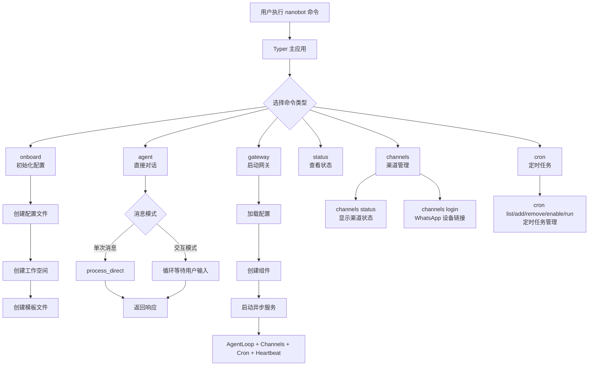

## 2. 整体架构流程图

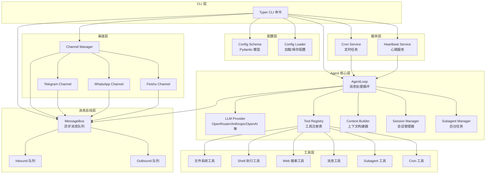

## 3. Gateway 启动流程详解

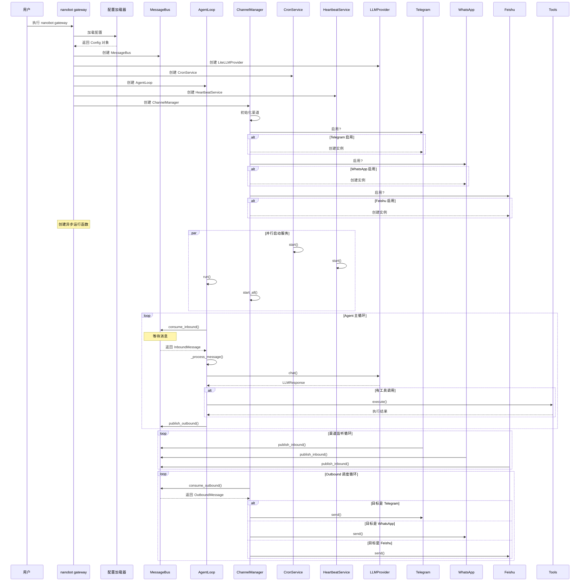

## 4. Agent 消息处理流程详解

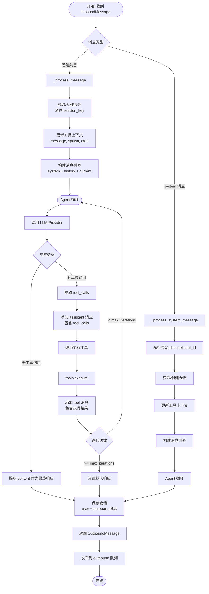

## 5. 消息总线 (MessageBus) 架构

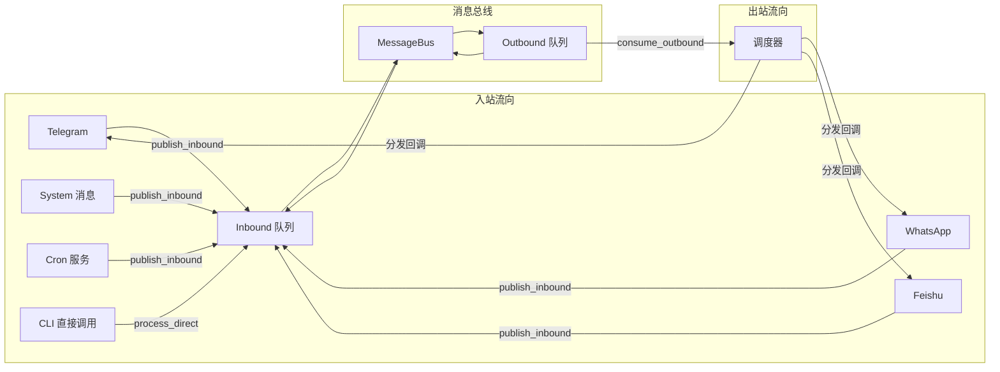

### 5.1 MessageBus 核心接口

| 方法 | 说明 | 方向 |
|------|------|------|
| `publish_inbound(msg)` | 发布入站消息 | Channel → Agent |
| `consume_inbound()` | 消费入站消息（阻塞） | Agent 读取 |
| `publish_outbound(msg)` | 发布出站消息 | Agent → Channel |
| `consume_outbound()` | 消费出站消息（阻塞） | Channel 读取 |
| `subscribe_outbound(channel, cb)` | 订阅特定渠道的出站消息 | Channel 注册 |
| `dispatch_outbound()` | 分发出站消息到订阅者 | 后台任务 |

## 6. 工具系统 (Tool Registry)

### 6.1 内置工具列表

| 工具名称 | 模块 | 功能 |
|----------|--------|------|
| `read_file` | filesystem.py | 读取文件内容 |
| `write_file` | filesystem.py | 写入文件 |
| `edit_file` | filesystem.py | 编辑文件 |
| `list_dir` | filesystem.py | 列出目录 |
| `exec` | shell.py | 执行 Shell 命令 |
| `web_search` | web.py | Web 搜索 |
| `web_fetch` | web.py | 获取网页内容 |
| `message` | message.py | 发送消息到渠道 |
| `spawn` | spawn.py | 创建后台子任务 |
| `cron` | cron.py | 管理定时任务 |

### 6.2 工具注册和执行流程

```mermaid
sequenceDiagram
    participant Loop as AgentLoop
    participant Registry as ToolRegistry
    participant Tool as 具体工具

    Note over Loop: _register_default_tools()
    Loop->>Registry: register(ReadFileTool())
    Loop->>Registry: register(WriteFileTool())
    Loop->>Registry: register(ExecTool())
    Loop->>Registry: register(WebSearchTool())
    Loop->>Registry: register(MessageTool())
    Loop->>Registry: register(SpawnTool())
    Loop->>Registry: register(CronTool())

    Note over Loop: LLM 返回工具调用
    Loop->>Registry: execute(tool_name, params)
    Registry->>Registry: validate_params(params)
    alt 参数验证失败
        Registry-->>Loop: 返回错误信息
    end

    Registry->>Tool: execute(**params)
    Tool-->>Registry: 返回执行结果
    Registry-->>Loop: 返回结果字符串
```

## 7. 上下文构建 (Context Builder)

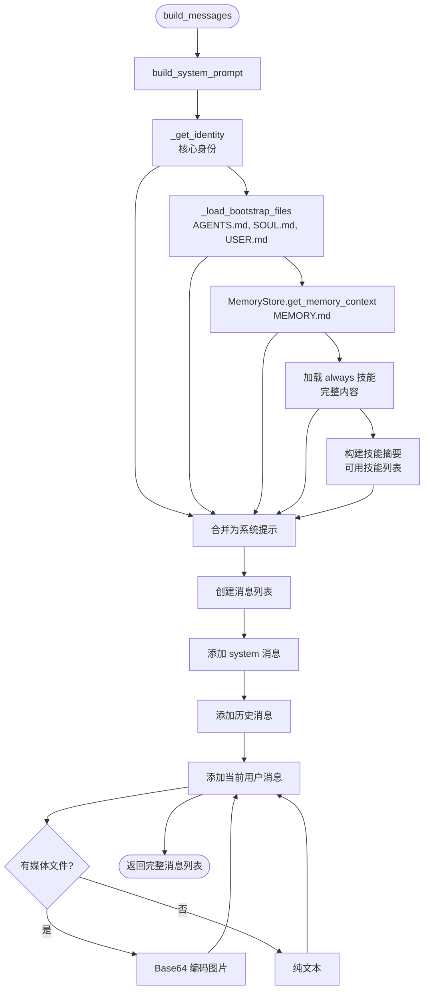

### 7.1 Bootstrap 文件加载顺序

1. **AGENTS.md** - Agent 指令和指南
2. **SOUL.md** - AI 个性特征
3. **USER.md** - 用户偏好设置
4. **TOOLS.md** - 工具文档（可选）
5. **IDENTITY.md** - 身份定义（可选）

### 7.2 技能加载机制

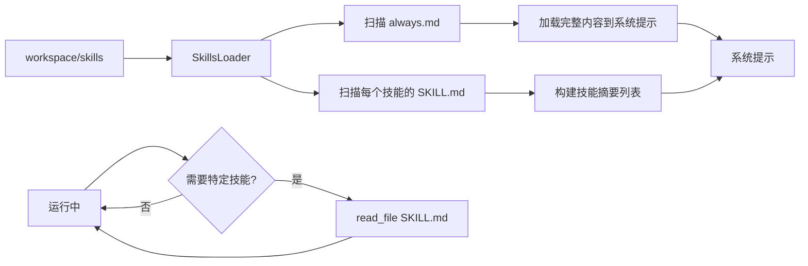

## 8. 会话管理 (Session Manager)

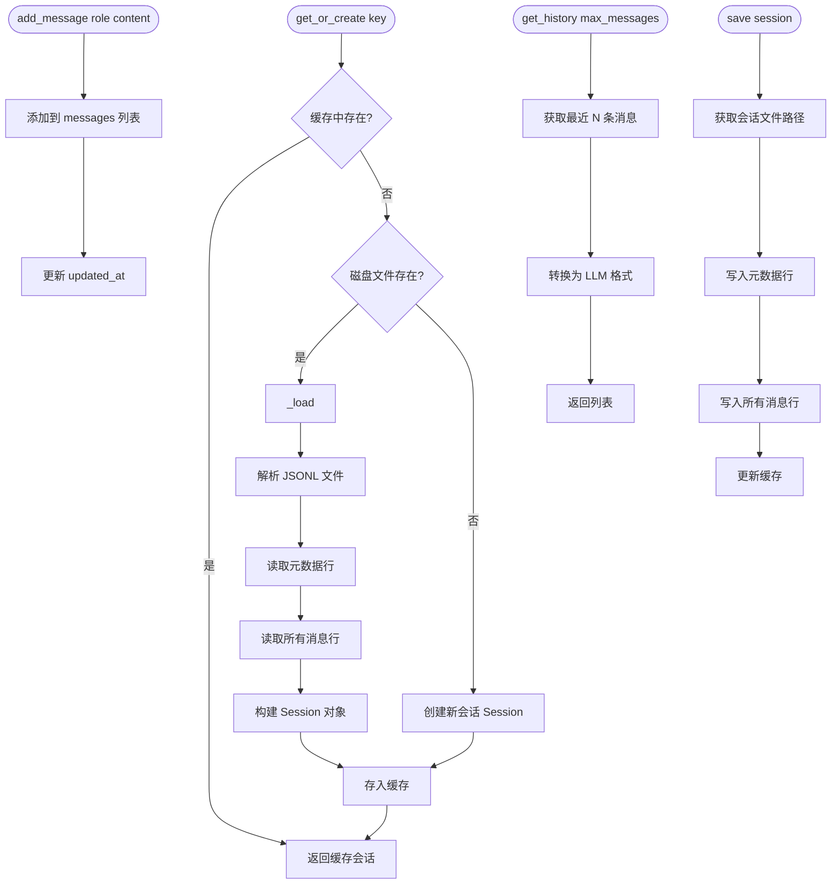

### 8.1 会话文件格式 (JSONL)

```jsonl
{"_type":"metadata","created_at":"2026-02-10T10:00:00","updated_at":"2026-02-10T10:30:00","metadata":{}}
{"role":"user","content":"Hello","timestamp":"2026-02-10T10:00:00"}
{"role":"assistant","content":"Hi there!","timestamp":"2026-02-10T10:00:05"}
{"role":"user","content":"How are you?","timestamp":"2026-02-10T10:01:00"}
{"role":"assistant","content":"I'm doing well!","timestamp":"2026-02-10T10:01:05"}
```

## 9. 子代理系统 (Subagent Manager)

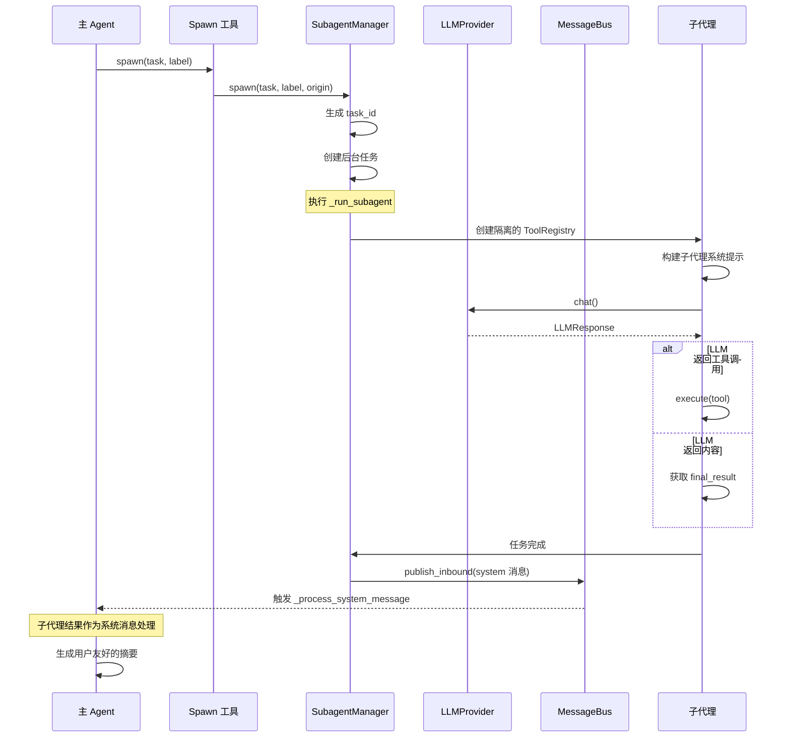

### 9.1 子代理工具限制

子代理只能使用以下工具（无消息和 spawn 功能）：
- 文件系统工具
- Shell 执行工具
- Web 搜索工具

这确保子代理专注于执行任务，不会：
- 发送消息给用户
- 创建更多子代理
- 访问主代理的对话历史

## 10. 定时任务服务 (Cron Service)

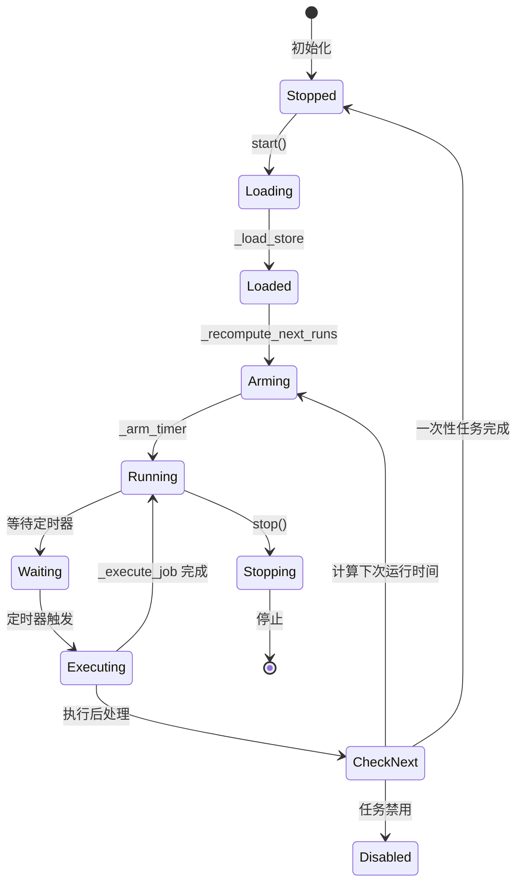

### 10.1 定时任务类型

| 类型 | 参数 | 说明 |
|------|------|------|
| `every` | `every_ms` | 每隔 N 毫秒执行一次 |
| `cron` | `expr` | Cron 表达式（如 `0 9 * * *`） |
| `at` | `at_ms` | 在指定时间戳执行一次 |

### 10.2 定时任务执行流程

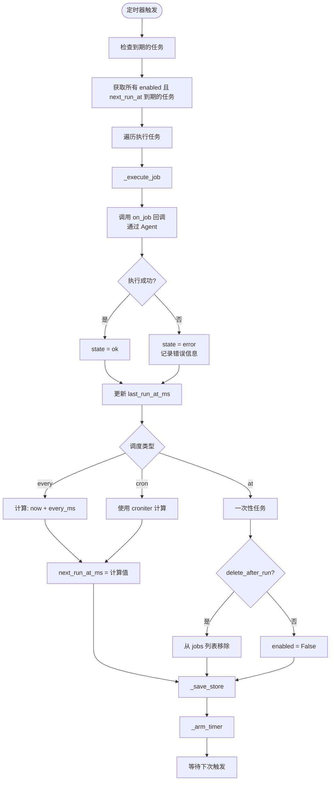

## 11. 渠道管理 (Channel Manager)

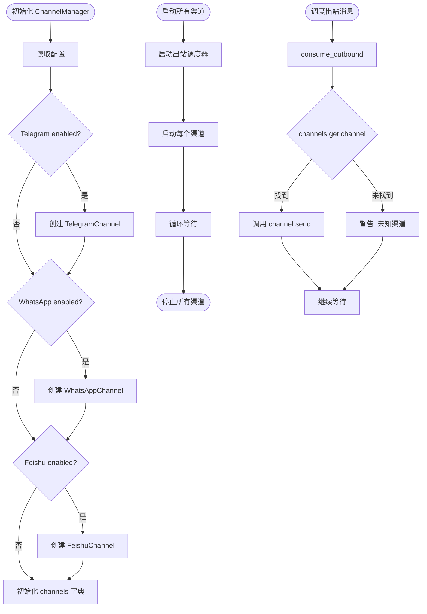

### 11.1 各渠道特性

| 渠道 | 认证方式 | 连接类型 | 特殊功能 |
|------|----------|---------|---------|
| Telegram | Bot Token | HTTP Long Polling | 支持代理、语音转录（Groq） |
| WhatsApp | QR 扫码 | WebSocket | 需要 Node.js 桥接服务 |
| Feishu | App ID + Secret | WebSocket Long Connection | 无需公网 IP |

## 12. 配置系统

### 12.1 配置加载优先级

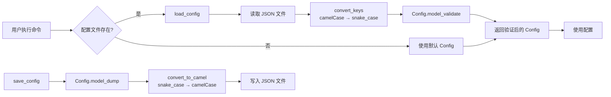

### 12.2 API Key 优先级

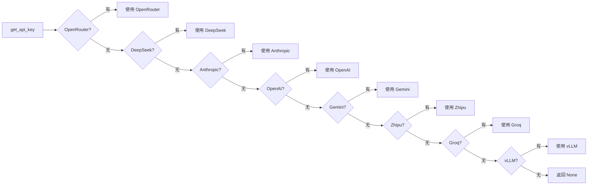

## 13. 文件目录结构

```
~/.nanobot/
├── config.json              # 主配置文件
├── workspace/              # 工作空间
│   ├── AGENTS.md          # Agent 指令
│   ├── SOUL.md            # AI 个性
│   ├── USER.md            # 用户信息
│   ├── memory/            # 长期记忆
│   │   └── MEMORY.md      # 持久化记忆
│   └── skills/           # 自定义技能
│       └── {skill-name}/
│           ├── SKILL.md   # 技能定义
│           └── always.md  # 是否始终加载
├── sessions/              # 会话存储
│   ├── cli_direct.jsonl   # CLI 会话
│   ├── telegram_123.jsonl  # Telegram 会话
│   └── whatsapp_456.jsonl # WhatsApp 会话
├── data/                 # 数据目录
│   └── cron/
│       └── jobs.json      # 定时任务存储
└── bridge/               # WhatsApp 桥接服务
    ├── package.json
    ├── dist/
    │   └── index.js
    └── ...
```

## 14. 关键数据流

### 14.1 用户通过 CLI 单次对话流程

```mermaid
sequenceDiagram
    participant User as 用户
    participant CLI as nanobot agent -m
    participant Loop as AgentLoop
    participant Bus as MessageBus
    participant Provider as LLMProvider

    User->>CLI: nanobot agent -m "Hello"
    CLI->>Loop: process_direct("Hello")
    Loop->>Loop: 创建 InboundMessage
    Loop->>Loop: _process_message(msg)
    Loop->>Loop: 获取/创建会话
    Loop->>Loop: 构建消息列表
    Loop->>Provider: chat()
    Provider-->>Loop: LLMResponse
    Loop->>Loop: 保存会话
    Loop-->>CLI: 返回响应文本
    CLI-->>User: 🐈 响应内容
```

### 14.2 用户通过 Telegram 对话流程

```mermaid
sequenceDiagram
    participant User as Telegram 用户
    participant TG as Telegram Channel
    participant Bus as MessageBus
    participant Loop as AgentLoop
    participant Provider as LLMProvider
    participant CM as ChannelManager

    User->>TG: 发送消息
    TG->>TG: 接收并验证
    alt 用户在允许列表
        TG->>Bus: publish_inbound(InboundMessage)
        Bus->>Loop: consume_inbound()
        Loop->>Loop: _process_message(msg)
        Loop->>Loop: 获取/创建会话
        Loop->>Loop: 构建消息列表
        Loop->>Provider: chat()
        Provider-->>Loop: LLMResponse
        Loop->>Bus: publish_outbound(OutboundMessage)
        Bus->>CM: consume_outbound()
        CM->>TG: send(msg)
        TG->>User: 发送响应
    else 用户不在允许列表
        TG->>User: 忽略/拒绝
    end
```

### 14.3 定时任务触发流程

```mermaid
sequenceDiagram
    participant Cron as CronService
    participant Timer as 定时器
    participant Loop as AgentLoop
    participant Provider as LLMProvider
    participant Bus as MessageBus
    participant CM as ChannelManager

    Note over Cron: 定时器等待
    Timer->>Cron: 触发 (时间到)
    Cron->>Cron: _on_timer()
    Cron->>Cron: 获取到期任务

    loop 每个到期任务
        Cron->>Loop: process_direct(message, session_key)
        Loop->>Loop: _process_message(msg)
        Loop->>Provider: chat()
        Provider-->>Loop: LLMResponse
        Loop-->>Cron: 返回响应

        alt deliver=true 且配置了 to
            Cron->>Bus: publish_outbound(OutboundMessage)
            Bus->>CM: consume_outbound()
            CM->>Channel: send(msg)
            Channel->>User: 发送消息
        end

        Cron->>Cron: 更新任务状态
        Cron->>Cron: 计算下次运行时间
    end

    Cron->>Cron: _arm_timer()
```

## 15. 异常处理和错误恢复

```mermaid
flowchart TD
    ERROR([发生异常]) --> CATCH{异常类型}

    CATCH -->|配置加载失败| CONFIG_ERR[使用默认配置]
    CONFIG_ERR --> LOG_WARN[记录警告日志]
    LOG_WARN --> CONTINUE[继续执行]

    CATCH -->|消息处理失败| MSG_ERR[捕获异常]
    MSG_ERR --> LOG_ERROR[记录错误日志]
    LOG_ERROR --> ERR_MSG[发送错误响应]
    ERR_MSG --> BUS_PUB[publish_outbound]
    BUS_PUB --> CONTINUE

    CATCH -->|工具执行失败| TOOL_ERR[返回错误字符串]
    TOOL_ERR --> ADD_MSG[添加 tool 消息到历史]
    ADD_MSG --> RETRY[重试 LLM]

    CATCH -->|渠道发送失败| CH_ERR[捕获异常]
    CH_ERR --> LOG_CH[记录渠道错误]
    LOG_CH --> SKIP_MSG[跳过当前消息]
    SKIP_MSG --> CONTINUE
```

## 总结

Nanobot 的核心架构设计遵循以下原则：

1. **解耦设计**：消息总线实现渠道和 Agent 的完全解耦
2. **异步优先**：所有 I/O 操作都使用 asyncio 异步处理
3. **可扩展性**：通过 Tool Registry 和 Channel Manager 实现插件式扩展
4. **状态持久化**：会话、配置、定时任务都持久化到磁盘
5. **轻量级**：约 4,000 行核心代码，易于理解和修改

通过 CLI 命令 `nanobot gateway` 启动后，系统形成一个完整的事件循环：
- 渠道接收用户消息 → MessageBus 入站队列 → AgentLoop 处理 → LLM 推理 → 工具执行 → MessageBus 出站队列 → 渠道发送响应
- 同时，CronService 和 HeartbeatService 可以触发内部消息进入处理流程
- 复杂任务可以交给子代理后台执行，完成后通过系统消息通知主代理
