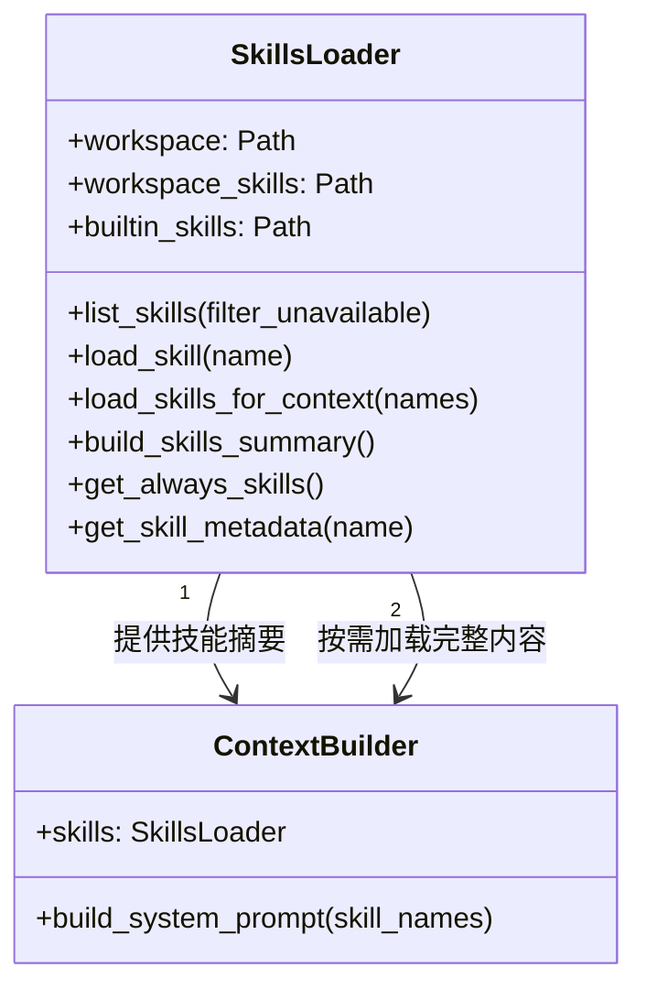
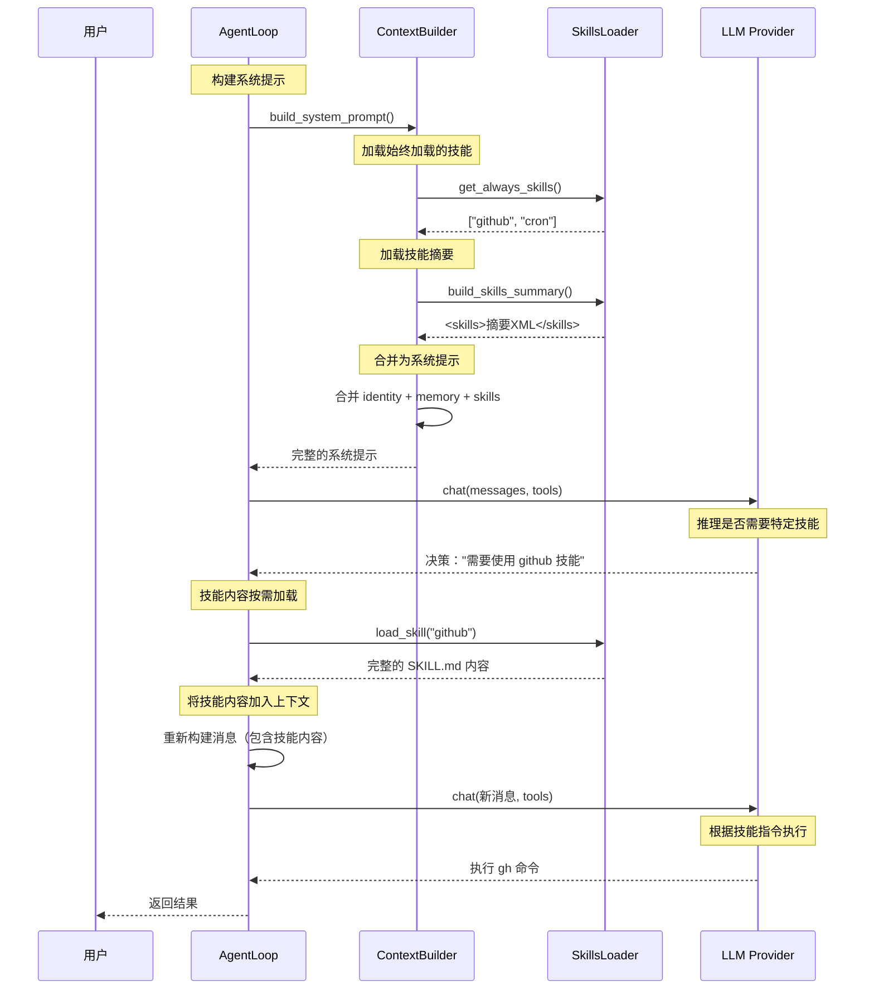
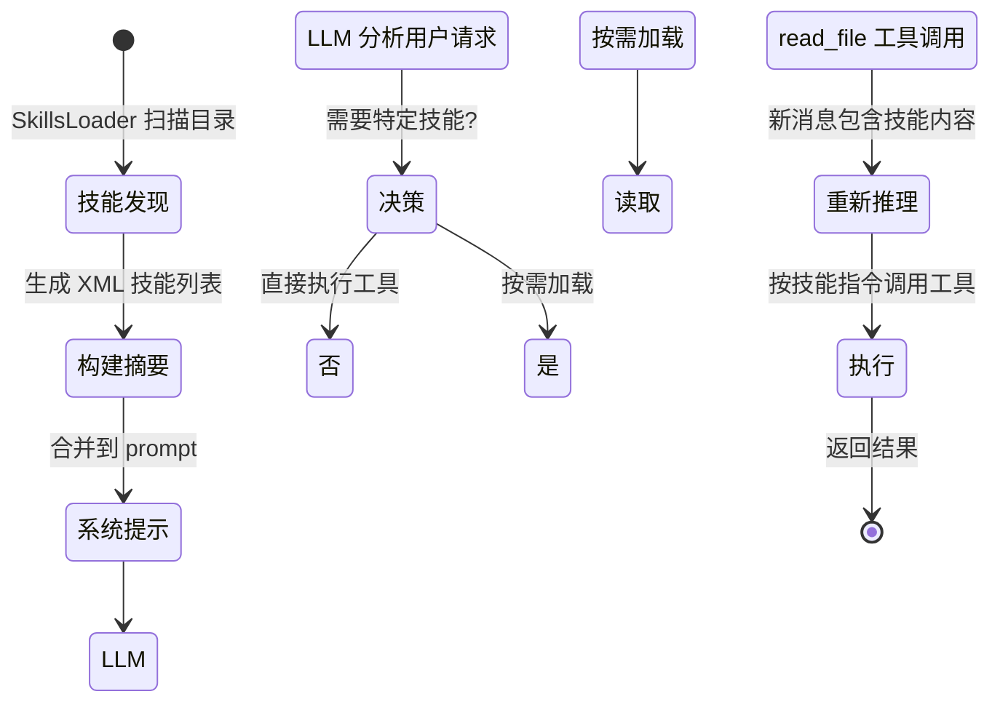

# Nanobot Skills 系统详细分析 - 初学者指南

## 目录

1. [概述](#概述)
2. [Skills 目录结构](#skills-目录结构)
3. [技能格式详解](#技能格式详解)
4. [技能加载机制](#技能加载机制)
5. [技能调用流程](#技能调用流程)
6. [内置技能分析](#内置技能分析)
7. [创建自定义技能](#创建自定义技能)
8. [最佳实践](#最佳实践)

---

## 概述

Nanobot 的 Skills 系统是一种**渐进式加载**的知识扩展机制。技能不是代码模块，而是**基于 Markdown 的指令文档**，指导 Agent 如何使用特定工具或执行特定任务。

### 核心设计理念

```
┌─────────────────────────────────────────────────────────────┐
│  Context Window (上下文窗口) - 有限且宝贵的资源      │
├─────────────────────────────────────────────────────────┤
│ 系统提示     ~1000-2000 tokens          │
│ 对话历史     ~5000-10000 tokens         │
│ 技能摘要       ~500-1000 tokens           │
│ 实际用户请求  ~100-500 tokens           │
└─────────────────────────────────────────────────────────┘
```

**关键原则**：不要一次性加载所有技能内容到上下文，而是按需加载。

---

## Skills 目录结构

```
nanobot/
├── skills/                           # 内置技能目录
│   ├── github/
│   │   └── SKILL.md              # 技能定义文件（必需）
│   ├── weather/
│   │   └── SKILL.md
│   ├── summarize/
│   │   └── SKILL.md
│   ├── cron/
│   │   └── SKILL.md
│   ├── tmux/
│   │   ├── SKILL.md
│   │   └── scripts/               # 可选的脚本目录
│   │       ├── wait-for-text.sh
│   │       └── find-sessions.sh
│   └── skill-creator/
│       └── SKILL.md
│
~/.nanobot/workspace/                  # 用户工作空间
└── skills/                       # 用户自定义技能目录（优先级更高）
    └── my-custom-skill/
        ├── SKILL.md
        ├── scripts/                # 可选：可执行脚本
        ├── references/             # 可选：参考文档
        └── assets/                # 可选：资源文件
```

### 目录优先级

1. **Workspace 技能** (`~/.nanobot/workspace/skills/`) - **最高优先级**
2. **Built-in 技能** (`nanobot/skills/`) - 被用户技能覆盖

---

## 技能格式详解

每个技能目录必须包含一个 `SKILL.md` 文件，格式如下：

### YAML Frontmatter (前置元数据)

```yaml
---
name: github
description: "Interact with GitHub using `gh` CLI..."
homepage: https://wttr.in/:help
metadata: {
  "nanobot": {
    "emoji": "🐙",
    "requires": {
      "bins": ["gh"],
      "env": ["API_KEY"]
    },
    "always": true,
    "install": [
      {
        "id": "brew",
        "kind": "brew",
        "formula": "gh",
        "bins": ["gh"],
        "label": "Install GitHub CLI (brew)"
      }
    ]
  }
}
---
```

### Frontmatter 字段说明

| 字段 | 类型 | 必需 | 说明 |
|------|------|--------|------|
| `name` | string | ✅ | 技能名称（目录名） |
| `description` | string | ✅ | 技能描述，**Agent 据此判断何时使用技能** |
| `homepage` | string | ❌ | 技能主页 URL |
| `metadata.nanobot.emoji` | string | ❌ | 图标符号 |
| `metadata.nanobot.requires.bins` | list | ❌ | 必需的可执行程序（如 `["curl", "gh"]`） |
| `metadata.nanobot.requires.env` | list | ❌ | 必需的环境变量 |
| `metadata.nanobot.always` | boolean | ❌ | 是否始终加载到上下文 |
| `metadata.nanobot.install` | list | ❌ | 安装指令（用于未满足依赖时提示） |

### Markdown Body (指令体)

```markdown
# GitHub Skill

Use `gh` CLI to interact with GitHub.

## Pull Requests

Check CI status on a PR:
```bash
gh pr checks 55 --repo owner/repo
```

## API for Advanced Queries

The `gh api` command is useful for accessing data:
```bash
gh api repos/owner/repo/pulls/55
```
```

---

## 技能加载机制

### SkillsLoader 类核心方法



### 方法详解

#### 1. `list_skills()` - 扫描所有可用技能

```python
def list_skills(self, filter_unavailable: bool = True) -> list[dict[str, str]]:
    """
    扫描顺序：
    1. workspace/skills/ （用户技能，优先级高）
    2. builtin_skills/ （内置技能，不覆盖同名用户技能）

    返回格式：
    [
      {"name": "github", "path": "...", "source": "workspace"},
      {"name": "weather", "path": "...", "source": "builtin"}
    ]
    """
```

#### 2. `_check_requirements()` - 检查依赖是否满足

```python
def _check_requirements(self, skill_meta: dict) -> bool:
    """
    检查：
    1. bins: 使用 shutil.which() 检查命令是否存在
    2. env: 使用 os.environ.get() 检查环境变量

    示例：
    requires = {
        "bins": ["curl", "gh"],
        "env": ["OPENAI_API_KEY"]
    }
    """
    for b in requires.get("bins", []):
        if not shutil.which(b):
            return False  # curl 不存在
    for env in requires.get("env", []):
        if not os.environ.get(env):
            return False  # 环境变量未设置
    return True
```

#### 3. `get_always_skills()` - 获取始终加载的技能

```python
def get_always_skills(self) -> list[str]:
    """
    返回所有：
    - metadata.always = true
    - 依赖检查通过

    这些技能的完整内容会被加载到每次对话的系统提示中。
    """
    result = []
    for skill in self.list_skills(filter_unavailable=True):
        if skill_meta.get("always"):
            result.append(skill["name"])
    return result
```

#### 4. `build_skills_summary()` - 构建技能摘要（XML 格式）

```python
def build_skills_summary(self) -> str:
    """
    为所有技能生成 XML 摘要：
    <skills>
      <skill available="true">
        <name>github</name>
        <description>Interact with GitHub...</description>
        <location>/path/to/skill/SKILL.md</location>
      </skill>
      <skill available="false">
        <name>summarize</name>
        <requires>CLI: summarize</requires>
      </skill>
    </skills>

    作用：让 Agent 知道有哪些技能可用，
    但不加载完整内容（节省 token）。
    """
```

---

## 技能调用流程

### 完整调用链



### 详细步骤分解

#### 步骤 1: 初始化时加载技能摘要

```python
# ContextBuilder.build_system_prompt()

# 1. 加载核心身份
identity = self._get_identity()  # "nanobot 🐈 你是..."

# 2. 加载 bootstrap 文件
bootstrap = self._load_bootstrap_files()  # AGENTS.md, SOUL.md, USER.md

# 3. 加载始终技能 (always=true)
always_skills = self.skills.get_always_skills()  # ["github", "cron"]
always_content = self.skills.load_skills_for_context(always_skills)
# 结果：
# ### Skill: github
#
# Use `gh` CLI to interact with GitHub...

# ### Skill: cron
#
# Use `cron` tool to schedule reminders...

# 4. 加载所有技能摘要（仅元数据）
skills_summary = self.skills.build_skills_summary()
# 结果：
# <skills>
#   <skill available="true"><name>github</name>...</skill>
#   <skill available="false"><name>summarize</name><requires>CLI: summarize</requires></skill>
# </skills>

# 5. 合并为系统提示
system_prompt = f"{identity}\n\n{bootstrap}\n\n{always_content}\n\n{skills_summary}"
```

#### 步骤 2: LLM 决策是否需要加载特定技能

```
LLM 看到的系统提示（部分）：
# Skills
The following skills extend your capabilities. To use a skill, read its SKILL.md file using read_file tool.
Skills with available="false" need dependencies installed first.

<skills>
  <skill available="true">
    <name>github</name>
    <description>Interact with GitHub using `gh` CLI...</description>
  </skill>
  <skill available="false">
    <name>summarize</name>
    <requires>CLI: summarize</requires>
  </skill>
</skills>
```

**用户说**："帮我查看 GitHub 上的 PR #55 的状态"

**LLM 推理**：
1. 用户提到 GitHub PR
2. 有个 `github` 技能可用
3. 需要加载完整内容来了解如何使用

#### 步骤 3: Agent 读取技能内容

```python
# LLM 发出工具调用
tool_calls = [
    {
        "id": "call_001",
        "type": "function",
        "function": {
            "name": "read_file",
            "arguments": {
                "file_path": "/path/to/nanobot/skills/github/SKILL.md"
            }
        }
    }
]

# Agent 执行工具
result = await self.tools.execute("read_file", {"file_path": "..."})
# 返回完整的 SKILL.md 内容（49 行 Markdown）
```

#### 步骤 4: 技能内容加入消息上下文

```python
# AgentLoop._process_message()

# 1. 将工具调用和结果添加到消息历史
messages = self.context.add_assistant_message(
    messages,
    content=None,
    tool_calls=[tool_call_dicts]
)
messages = self.context.add_tool_result(
    messages,
    "call_001",
    "read_file",
    "# GitHub Skill\n\nUse `gh` CLI..."
)

# 2. 重新调用 LLM（现在包含完整技能内容）
response = await self.provider.chat(
    messages=messages,  # 现在包含技能完整内容
    tools=self.tools.get_definitions()
)
```

#### 步骤 5: 根据技能指令执行

```python
# LLM 现在看到完整的技能内容：
# GitHub Skill
#
# Use `gh` CLI to interact with GitHub. Always specify `--repo owner/repo` when not in a git directory...
#
## Pull Requests
#
# Check CI status on a PR:
# ```bash
# gh pr checks 55 --repo owner/repo
# ```

# LLM 生成正确的工具调用
tool_calls = [
    {
        "id": "call_002",
        "type": "function",
        "function": {
            "name": "exec",
            "arguments": {
                "command": "gh pr checks 55 --repo owner/repo"
            }
        }
    }
]
```

---

## 内置技能分析

### 1. GitHub 技能

**文件**: `nanobot/skills/github/SKILL.md`

**元数据**:
```yaml
name: github
description: "Interact with GitHub using `gh` CLI..."
metadata:
  nanobot:
    emoji: "🐙"
    requires:
      bins: ["gh"]
    install: [...]
```

**功能**:
- 查询 PR 状态
- 列出 CI 运行记录
- 获取失败的日志
- 使用 `gh api` 进行高级查询
- JSON 输出 + `jq` 过滤

**调用示例**:
```
用户: 检查 PR #55 的 CI 状态
LLM: read_file github/SKILL.md
LLM: exec "gh pr checks 55 --repo owner/repo"
```

### 2. Weather 技能

**文件**: `nanobot/skills/weather/SKILL.md`

**元数据**:
```yaml
name: weather
description: "Get current weather and forecasts (no API key required)."
metadata:
  nanobot:
    emoji: "🌤️"
    requires:
      bins: ["curl"]
```

**功能**:
- wttr.in（主要）：简洁命令、格式化输出
- Open-Meteo（备用）：JSON 输出、API 友好

**调用示例**:
```
用户: 北京现在天气怎么样？
LLM: read_file weather/SKILL.md
LLM: exec "curl -s 'wttr.in/Beijing?format=3'"
```

### 3. Cron 技能

**文件**: `nanobot/skills/cron/SKILL.md`

**元数据**:
```yaml
name: cron
description: "Schedule reminders and recurring tasks."
```

**功能**:
- 提醒模式：直接发送消息给用户
- 任务模式：Agent 执行任务并发送结果
- 支持时间表达式：`every_seconds`, `cron_expr`

**注意**：这个技能使用内置的 `cron` 工具，而不是外部命令。

**调用示例**:
```
用户: 每小时提醒我休息一下
LLM: read_file cron/SKILL.md
LLM: 调用 cron(action="add", message="Time to take a break!", every_seconds=3600)
```

### 4. Summarize 技能

**文件**: `nanobot/skills/summarize/SKILL.md`

**元数据**:
```yaml
name: summarize
description: "Summarize URLs, files, and YouTube videos..."
metadata:
  nanobot:
    emoji: "🧾"
    requires:
      bins: ["summarize"]
    install: [...]
```

**功能**:
- 总结 URL、文件
- YouTube 视频转录（尽力而为）
- 支持多种模型（OpenAI、Anthropic、xAI、Google）

**调用示例**:
```
用户: 总结这个 YouTube 视频 https://youtu.be/xxx
LLM: read_file summarize/SKILL.md
LLM: exec "summarize 'https://youtu.be/xxx' --youtube auto --extract-only"
```

### 5. TMUX 技能

**文件**: `nanobot/skills/tmux/SKILL.md`

**结构**:
```
tmux/
├── SKILL.md
└── scripts/
    ├── wait-for-text.sh      # 等待文本出现
    └── find-sessions.sh      # 查找会话
```

**特点**：包含可执行脚本，直接调用而非在 SKILL.md 中写命令。

---

## 创建自定义技能

### 步骤 1: 使用 skill-creator 技能

```
用户: 帮我创建一个视频处理技能
Agent: read_file skill-creator/SKILL.md
Agent: 按照步骤执行
```

### 步骤 2: 技能目录结构

```
my-video-skill/
├── SKILL.md           # 必需：定义 + 指令
├── scripts/           # 可选：可执行脚本
│   └── process.py
├── references/         # 可选：参考文档
│   └── formats.md
└── assets/            # 可选：资源文件
    └── template.mp4
```

### 步骤 3: 编写 SKILL.md

**完整的 SKILL.md 示例**：

```markdown
---
name: video-processor
description: "Process and edit videos using FFmpeg. Use when user asks to trim, merge, or convert videos."
metadata: {
  "nanobot": {
    "emoji": "🎬",
    "requires": {
      "bins": ["ffmpeg"]
    }
  }
}
---

# Video Processor

Process videos using FFmpeg.

## Trimming Videos

Cut first 10 seconds:
```bash
ffmpeg -i input.mp4 -t 10 -c copy output.mp4
```

Trim from 00:30 to 01:00:
```bash
ffmpeg -i input.mp4 -ss 00:30 -to 01:00 -c copy output.mp4
```

## Merging Videos

Join two videos:
```bash
ffmpeg -f concat -i <(for f in video1.mp4 video2.mp4; do echo "file '$PWD/$f'"; done) -c copy output.mp4
```

## Converting Formats

MP4 to WebM:
```bash
ffmpeg -i input.mp4 -c:v libvpx-vp9 -c:a libopus output.webm
```

## Extracting Audio

Extract audio as MP3:
```bash
ffmpeg -i input.mp4 -vn -acodec libmp3lame output.mp3
```

## When to use

Use this skill when user asks to:
- "Trim this video"
- "Merge these videos"
- "Convert to MP4/WebM"
- "Extract audio from video"
- "Crop/resize video"

## Quality Notes

- Use `-c copy` for lossless operations (trimming, merging)
- Specify codec for encoding: `-c:v libx264` for H.264
- Use `-crf 23` for good quality (lower = better, range 0-51)
```

### 步骤 4: 放置到用户工作空间

```bash
# 创建技能目录
mkdir -p ~/.nanobot/workspace/skills/video-processor

# 复制技能文件
cp SKILL.md ~/.nanobot/workspace/skills/video-processor/

# 如果有脚本/引用/资源，一并复制
```

### 步骤 5: Agent 自动发现

```
下次启动时，SkillsLoader 会自动：
1. 扫描 ~/.nanobot/workspace/skills/
2. 发现 video-processor/SKILL.md
3. 包含在技能摘要中
4. 当需要时，LLM 可以 read_file 加载它
```

---

## 最佳实践

### 1. 保持简洁

**❌ 不要这样做**：
```markdown
# Skill

这里是一个非常长的解释，说明什么是视频、什么是编码、什么是比特率...
（500+ 行，浪费 token）
```

**✅ 应该这样做**：
```markdown
---
name: video-processor
description: "Process videos using FFmpeg. Use for trimming, merging, converting."
---

# Video Processor

Trim videos:
```bash
ffmpeg -i input.mp4 -t 10 output.mp4
```
```

### 2. 使用渐进式披露

**三层加载机制**：

| 层级 | 内容 | 大小限制 | 加载时机 |
|------|--------|----------|----------|
| 1. Frontmatter | name + description | ~100 tokens | **始终** |
| 2. SKILL.md body | 完整指令 | <5k tokens | **按需** (LLM 决策) |
| 3. Bundled resources | 脚本/文档 | 无限制 | **按需** (工具调用) |

### 3. 条件性内容

**❌ 不要**：把所有信息都写进 SKILL.md

```markdown
# BigQuery Skill

## Revenue Queries
(100 行详细说明)

## Sales Queries
(100 行详细说明)

## Product Queries
(100 行详细说明)

## Marketing Queries
(100 行详细说明)
```

**✅ 应该这样做**：拆分到 references

```markdown
# BigQuery Skill

Quick queries use the `bq` CLI.

For detailed schemas and examples, see:
- [revenue.md](references/revenue.md) - Revenue metrics
- [sales.md](references/sales.md) - Sales pipelines
- [product.md](references/product.md) - Product API
```

当用户问销售问题时：
1. LLM 读取 SKILL.md（简短）
2. LLM 决策：需要看 sales.md
3. LLM read_file references/sales.md（仅加载相关部分）

### 4. 使用脚本而非重复指令

**❌ 不要这样做**：每次都让 LLM 写复杂命令

```markdown
# Skill

Rotate PDF (重复的复杂指令)...

```bash
# 1. 提取页面
# 2. 旋转页面
# 3. 重新合并
# (20+ 行重复代码)
```

**✅ 应该这样做**：使用 scripts/

```markdown
# PDF Processor

Use the rotate script for rotation:
```bash
./scripts/rotate_pdf.py input.pdf output.pdf 90
```

```
scripts/rotate_pdf.py (已测试、可靠)
```

### 5. 明确触发条件

**❌ 不好的描述**：
```yaml
description: "A skill about videos"
```

**✅ 好的描述**：
```yaml
description: "Process and edit videos using FFmpeg. Use when user asks to trim, merge, or convert videos. Triggers: 'trim video', 'merge videos', 'convert to MP4'"
```

LLM 看到描述后，能明确知道何时使用这个技能。

### 6. 正确的依赖检查

**内置工具检查**：
```python
metadata: {
  "nanobot": {
    "requires": {
      "bins": ["ffmpeg"],      # shutil.which("ffmpeg")
      "env": ["API_KEY"]     # os.environ.get("API_KEY")
    }
  }
}
```

如果依赖不满足：
- 技能在摘要中显示 `available="false"`
- 显示 `<requires>CLI: ffmpeg</requires>`
- LLM 知道技能不可用，不会尝试使用

### 7. 使用脚本避免重复加载

**场景**：技能需要执行固定的、确定性的操作

```
问题：每次都要让 LLM 构建相同的复杂命令
解决：创建可执行脚本
```

**示例技能结构**：
```
database-migrator/
├── SKILL.md
│   # 数据库迁移工具
│   # 使用 scripts/run_migration.sh 执行迁移
│   # 脚本包含完整的迁移逻辑
│   # SKILL.md 仅说明如何调用脚本
└── scripts/
    ├── run_migration.sh      # 主迁移脚本
    ├── schema_v1.py         # 数据库 schema v1
    └── schema_v2.py         # 数据库 schema v2
```

**调用过程**：
```
1. LLM read_file SKILL.md (简短)
2. LLM exec "./scripts/run_migration.sh --from=v1 --to=v2"
3. 脚本执行（无需加载到 LLM 上下文）
```

---

## 技能调用时序图总结



---

## 常见问题 (FAQ)

### Q1: 技能为什么不自动加载完整内容？

**A**: 上下文窗口有限。如果所有技能都完整加载，会占用 10k+ tokens，留给对话和用户请求的空间就少了。按需加载可以节省 80-90% 的 token。

### Q2: `always=true` 什么时候用？

**A**: 当技能是核心功能，几乎每次对话都可能用到时使用。例如：
- `github` - 如果用户经常查询 GitHub
- `cron` - 定时任务是常用功能

### Q3: 用户技能和内置技能同名怎么办？

**A**: 用户技能优先级更高。如果 `workspace/skills/github/` 存在，会覆盖内置的 `skills/github/`。

### Q4: 如何调试技能？

**A**: 在对话中直接测试：
1. "列出所有可用技能" → Agent 会显示技能摘要
2. "加载 github 技能" → Agent 会 read_file
3. "检查依赖" → 查看技能摘要中的 available 状态

### Q5: 技能可以用 Python 代码吗？

**A**: 技能本身必须是 Markdown，但可以：
1. 调用 scripts/ 目录下的 Python 脚本
2. 脚本中包含复杂的 Python 逻辑
3. SKILL.md 仅说明如何调用脚本

**示例**：
```markdown
# Complex Processing

Use the Python script for heavy lifting:
```bash
python3 scripts/complex_processor.py --input input.json --output output.json
```
```

---

## 总结

Nanobot 的 Skills 系统是一个精心设计的**渐进式加载框架**：

| 特性 | 设计 | 效果 |
|------|------|--------|
| 按需加载 | LLM 决策后读取技能内容 | 节省 80-90% token |
| 依赖检查 | 自动验证 bins 和 env 变量 | 避免失败调用 |
| 资源分离 | scripts/references/assets 可选 | 保持 SKILL.md 简洁 |
| 优先级机制 | 用户技能 > 内置技能 | 允许自定义覆盖 |
| 始终加载 | `always=true` 标记 | 常用技能即时可用 |

对于初学者来说，创建技能的关键是：
1. **理解用途** - 明确技能解决什么问题
2. **简洁描述** - Frontmatter 清晰说明触发条件
3. **按需内容** - SKILL.md 只写核心指令
4. **拆分大型内容** - 使用 references/ 和 scripts/
5. **测试迭代** - 在实际对话中验证效果
